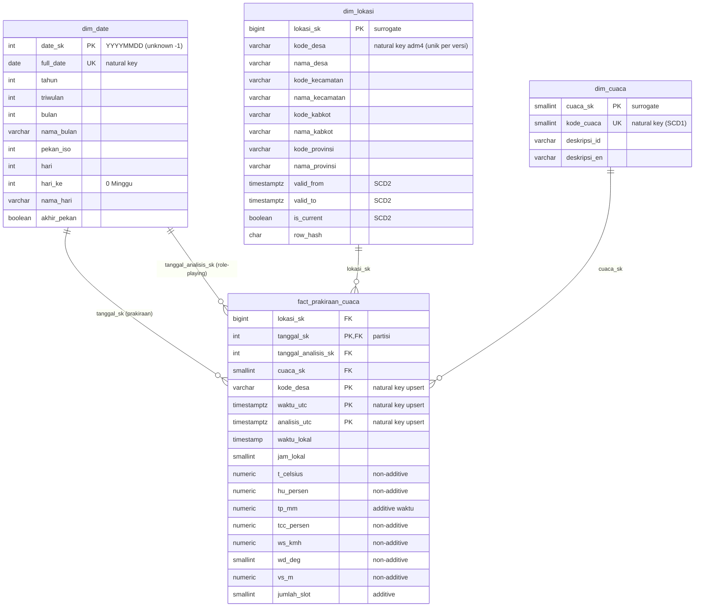

# DESIGN LOAD — T3 Cuaca BMKG (Kota Makassar)

## 1. Diagram star schema



Grain fact: **1 desa × 1 slot prakiraan 3-jaman × 1 run analisis BMKG**
(153 desa × ±19 slot = 2.874 baris pada snapshot 2026-09-19).

## 2. Alur

```
CSV snapshot (beku, commit di repo)
  provinsi / kabkot / kecamatan / desa / prakiraan_cuaca
        │  COPY (TRUNCATE + reload tiap batch)
        ▼
  stg_lokasi   stg_prakiraan          (schema stg, tanpa constraint, semua text → cast)
        │            │
        ▼            ▼
  dim_date     dim_cuaca    dim_lokasi        ← urutan: dim dulu
  (generator)  (SCD1)       (SCD2)
        └──────┬─────┴──────────┘
               ▼
      fact_prakiraan_cuaca  (lookup surrogate key → upsert)
```

Urutan eksekusi: `stg → dim_date → dim_cuaca → dim_lokasi → fact`. Satu transaksi per tabel; batch_id = timestamp snapshot (`20260919T152857Z`).

## 3. Strategi per tabel

| Tabel | Strategi | Natural key upsert | Partisi |
|---|---|---|---|
| `stg_lokasi`, `stg_prakiraan` | Truncate & reload (full refresh per batch) | – | – |
| `dim_date` | Full rebuild `CREATE OR REPLACE` dari generator `sql/10_dim_date.sql` (dosen) | `date_sk` / `full_date` | – |
| `dim_cuaca` | SCD1: upsert timpa | `kode_cuaca` | – |
| `dim_lokasi` | SCD2: tutup versi lama + sisip versi baru | `kode_desa` (+ `is_current`) | – |
| `fact_prakiraan_cuaca` | Upsert idempoten (`ON CONFLICT DO UPDATE`) | `kode_desa, waktu_utc, analisis_utc, tanggal_sk` | RANGE bulanan `tanggal_sk` |

### 3.1 dim_date
```sql
-- sql/10_dim_date.sql (diberikan dosen, tidak diubah)
CREATE OR REPLACE TABLE dim_date AS SELECT ... FROM generate_series(DATE '2024-01-01', DATE '2027-12-31', INTERVAL 1 DAY);
INSERT INTO dim_date SELECT -1, DATE '1900-01-01', ...;   -- anggota Unknown
-- sql/20_dim_date.sql: view role-playing dim_tanggal_prakiraan & dim_tanggal_analisis
```
Dibangun dari rentang tanggal, bukan dari data, jadi tidak bergantung pada staging.
**Menggandakan baris bila:** hanya `INSERT` anggota `-1` yang dijalankan ulang tanpa `CREATE OR REPLACE` di depannya → dua baris `date_sk = -1`; atau rentang generator diubah ke `timestamp` sehingga satu hari terhitung dua kali (zona waktu).

### 3.2 dim_cuaca (SCD1)
```sql
INSERT INTO dim_cuaca (kode_cuaca, deskripsi_id, deskripsi_en)
SELECT DISTINCT ON (kode_cuaca) kode_cuaca, weather_desc, weather_desc_en
FROM stg_prakiraan ORDER BY kode_cuaca, weather_desc
ON CONFLICT (kode_cuaca) DO UPDATE
   SET deskripsi_id = EXCLUDED.deskripsi_id,
       deskripsi_en = EXCLUDED.deskripsi_en,
       updated_at   = now();
```
**Menggandakan bila:** `UNIQUE(kode_cuaca)` tidak ada; atau natural key dipilih dari teks (`weather_desc`) sehingga kode 0 & 1 ("Cerah") tergabung/terbelah tidak konsisten; atau staging punya >1 deskripsi per kode dan `DISTINCT ON` dilewatkan (`ON CONFLICT` gagal di baris kembar dalam satu statement).

### 3.3 dim_lokasi (SCD2)
```sql
BEGIN;
-- (1) tutup versi aktif yang atributnya berubah
UPDATE dim_lokasi d
   SET valid_to = :batch_ts, is_current = false
  FROM stg_lokasi s
 WHERE d.kode_desa = s.kode_desa AND d.is_current AND d.row_hash <> s.row_hash;

-- (2) sisipkan versi baru (desa baru ATAU baru saja ditutup)
INSERT INTO dim_lokasi (kode_desa, nama_desa, kode_kecamatan, nama_kecamatan,
                        kode_kabkot, nama_kabkot, kode_provinsi, nama_provinsi,
                        valid_from, valid_to, is_current, row_hash)
SELECT s.kode_desa, s.nama_desa, s.kode_kecamatan, s.nama_kecamatan,
       s.kode_kabkot, s.nama_kabkot, s.kode_provinsi, s.nama_provinsi,
       CASE WHEN EXISTS (SELECT 1 FROM dim_lokasi x WHERE x.kode_desa = s.kode_desa)
            THEN :batch_ts ELSE TIMESTAMPTZ '1970-01-01' END,   -- load awal mencakup seluruh riwayat
       '9999-12-31', true, s.row_hash
  FROM stg_lokasi s
 WHERE NOT EXISTS (SELECT 1 FROM dim_lokasi d WHERE d.kode_desa = s.kode_desa AND d.is_current);
COMMIT;
```
**Menggandakan bila:** langkah (1) dan (2) tidak satu transaksi (gagal di tengah → 2 versi aktif; dicegah `uq_lokasi_current`); `row_hash` memuat kolom volatil (mis. timestamp) atau teks belum di-`trim` sehingga tiap batch dianggap "berubah"; `desa.csv` punya kode ganda; fact di-join ke `dim_lokasi` hanya dengan `kode_desa` tanpa rentang `valid_from/valid_to` (fan-out ×jumlah versi).

### 3.4 fact_prakiraan_cuaca
```sql
INSERT INTO fact_prakiraan_cuaca (lokasi_sk, tanggal_sk, tanggal_analisis_sk, cuaca_sk,
       kode_desa, waktu_utc, analisis_utc, waktu_lokal, jam_lokal, arah_angin, arah_angin_tujuan,
       t_celsius, hu_persen, tp_mm, tcc_persen, ws_kmh, wd_deg, vs_m, batch_id)
SELECT COALESCE(l.lokasi_sk, -1),                 -- desa tak dikenal → anggota Unknown, baris tidak hilang
       to_char(s.waktu_lokal::date,'YYYYMMDD')::int,
       to_char(s.analisis_utc::date,'YYYYMMDD')::int,
       COALESCE(c.cuaca_sk, -1),
       s.kode_desa, s.waktu_utc, s.analisis_utc, s.waktu_lokal,
       extract(hour FROM s.waktu_lokal), s.wd, s.wd_to,
       s.t, s.hu, s.tp, s.tcc, s.ws, s.wd_deg, s.vs, :batch_id
  FROM stg_prakiraan s
  LEFT JOIN dim_lokasi l ON l.kode_desa = s.kode_desa
                        AND s.waktu_utc >= l.valid_from AND s.waktu_utc < l.valid_to
  LEFT JOIN dim_cuaca  c ON c.kode_cuaca = s.kode_cuaca
ON CONFLICT (kode_desa, waktu_utc, analisis_utc, tanggal_sk) DO UPDATE
   SET lokasi_sk = EXCLUDED.lokasi_sk, cuaca_sk = EXCLUDED.cuaca_sk,
       t_celsius = EXCLUDED.t_celsius, hu_persen = EXCLUDED.hu_persen, tp_mm = EXCLUDED.tp_mm,
       tcc_persen = EXCLUDED.tcc_persen, ws_kmh = EXCLUDED.ws_kmh, wd_deg = EXCLUDED.wd_deg,
       vs_m = EXCLUDED.vs_m, batch_id = EXCLUDED.batch_id, loaded_at = now();
```
Kolom partisi: `tanggal_sk` (tanggal lokal WITA). Partisi bulanan dibuat sebelum load; sisanya masuk `_default`.

Lookup dimensi memakai `LEFT JOIN` + `COALESCE(…, -1)`: baris dengan desa/kode cuaca yang tidak ada di dimensi
tetap masuk sebagai anggota Unknown (dihitung test orphan), bukan terbuang diam-diam oleh inner join.
Snapshot ini: 153 desa di `desa.csv` = 153 desa di prakiraan → 0 baris jatuh ke `lokasi_sk = -1`.

**Menggandakan baris bila:**
1. **Run analisis berbeda.** Slot yang sama muncul lagi di tarikan berikutnya dengan `analisis_utc` baru → sah secara grain, tetapi `SUM(tp_mm)` / `COUNT` ganda. Pakai `v_prakiraan_terbaru` untuk agregasi (snapshot ini sudah punya 2 run: 12:00 dan 00:00).
2. **Natural key memakai `lokasi_sk`.** Bila SCD2 menerbitkan versi baru antar-batch, key berubah → `ON CONFLICT` tidak cocok. Karena itu NK memakai `kode_desa`.
3. **`tanggal_sk` berubah antar-batch** (mis. dihitung dari UTC di satu batch dan lokal di batch lain) → baris jatuh di partisi lain, konflik tidak terdeteksi.
4. **Zona waktu.** `analysis_date` tanpa zona di sumber; jika di-cast dengan zona berbeda antar-batch, NK berubah.
5. **Join SCD2 tanpa rentang validitas** (lihat 3.3) → fan-out.
6. **Load ulang batch lama tanpa `ON CONFLICT`** (plain `INSERT`) — PK menolak, tetapi bila PK dilepas terjadi duplikasi penuh.

### 3.5 Alternatif yang ditolak

| Alternatif | Untuk tabel | Kenapa ditolak |
|---|---|---|
| **Full refresh** (`TRUNCATE` + reload / `CREATE OR REPLACE`) | fact | Run analisis lama ikut terhapus — padahal menyimpan histori run adalah alasan grain memuat `analisis_utc`. BMKG tidak menyediakan arsip, jadi run yang terhapus tidak bisa ditarik ulang. (Tetap dipakai untuk staging, karena staging memang hanya cermin satu batch.) |
| **Insert-only** (append tanpa natural key) | fact | Tidak idempoten: load yang sama dijalankan 2× → 2 × 2874 = 5748 baris, semua measure ganda. |
| **Grain tanpa run / merge per run** — upsert pada `(kode_desa, waktu_utc)`, run terbaru menimpa | fact | Paling sederhana dan baris tidak pernah ganda, tetapi run lama hilang: tidak bisa membandingkan prakiraan antar-run, dan masalah run basi (18 baris / 1 desa dari run 2026-09-19T00) jadi tak terlihat oleh test. Kebutuhan "satu baris per slot" dipenuhi oleh view `v_prakiraan_terbaru`. |
| **DELETE partisi + insert ulang** | fact | Satu partisi bulanan menampung banyak batch & run; menghapus satu bulan untuk memuat satu batch ikut membuang run lain di bulan yang sama. |
| **SCD1 (overwrite)** | `dim_lokasi` | Pemekaran/ganti nama desa menimpa histori: fakta lama ikut "pindah" ke nama/induk baru. |

### 3.6 Konsumsi oleh kueri analitik
Semua kueri di `sql/40_analytics/` membaca `v_prakiraan_terbaru`, bukan tabel fact mentah, supaya `COUNT`/`SUM`
tidak ganda lintas run (skenario 1 di 3.4). Join ke `dim_lokasi` cukup lewat `lokasi_sk`: versi SCD2 yang benar
sudah dipilih saat load (lookup rentang validitas di 3.4), jadi kueri tidak perlu filter `is_current`.
Ambang siaga (t ≥ 33 °C atau ws ≥ 20 km/jam) ditulis di satu CTE `ambang` per kueri, sama dengan kamus metrik.

## 4. Catatan kualitas data snapshot
- `vs` dan `vs_text` 100% kosong → `vs_m` NULL semua.
- `weather` 0 dan 1 sama-sama "Cerah"; `tp` hanya {0, 0.1, 0.2}.
- `local_datetime` = UTC+8 (WITA); `analysis_date` diasumsikan UTC.
- Repo membekukan snapshot: jangan tarik ulang saat lab; tarik ulang hanya saat persiapan lalu commit ulang.
